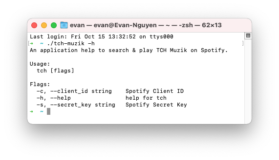

# The Coffee House Muzik [](https://github.com/dacsang97/tch-muzik/actions/workflows/build.yml)

Follow the music that is being played at The Coffee House and try to find and play it on Spotify.

<p align="center">

</p>

## Installation

Clone this project, run command:

```sh
make build
// OR: go build cmd/main.go
```

## Configuration

Create your application in the [Spotify for Developers Dashboard](https://developer.spotify.com/dashboard/applications).

Set the value for **Redirect URIs** in Settings:

```
http://127.0.0.1:51197/callback
```

In the application dashboard, find your `Client ID` and `Secret Key`.\
Make a file called `.tchmuzik.yaml`. in the Home folder `~`:

```yaml
client_id:
secret_key:
```

or set enviroment variables:

```
set TCH_CLIENT_ID xxx
set TCH_SECRET_KEY xxx
```

### Usage

Open Spotify and choose a device. On a PC, you can play a song and then pause it, and Spotify will set the PC as the default device.

Run command:

```
./tch-muzik -c YOUR_CLIENT_ID -s YOUR_SECRET_KEY
```
